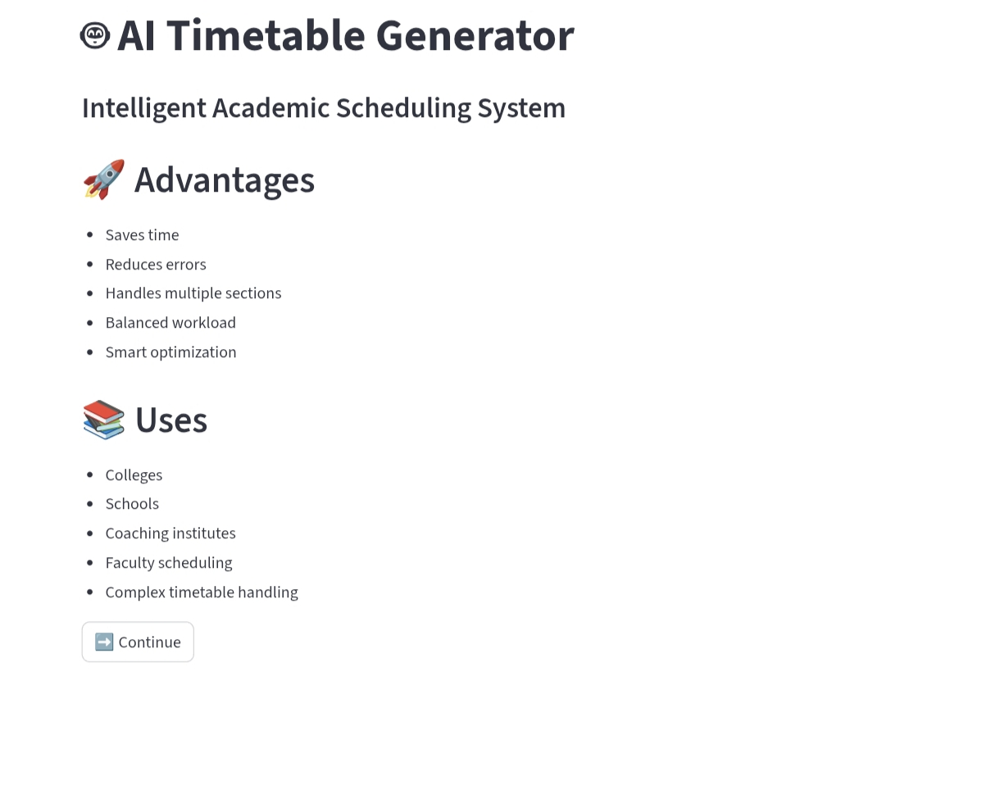
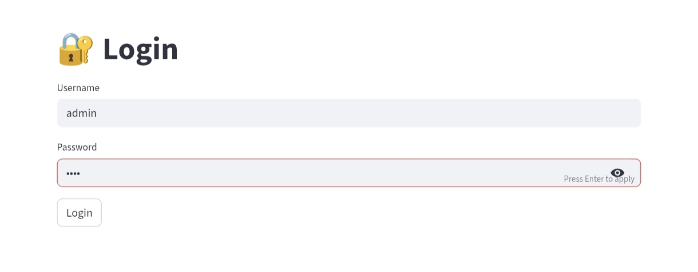
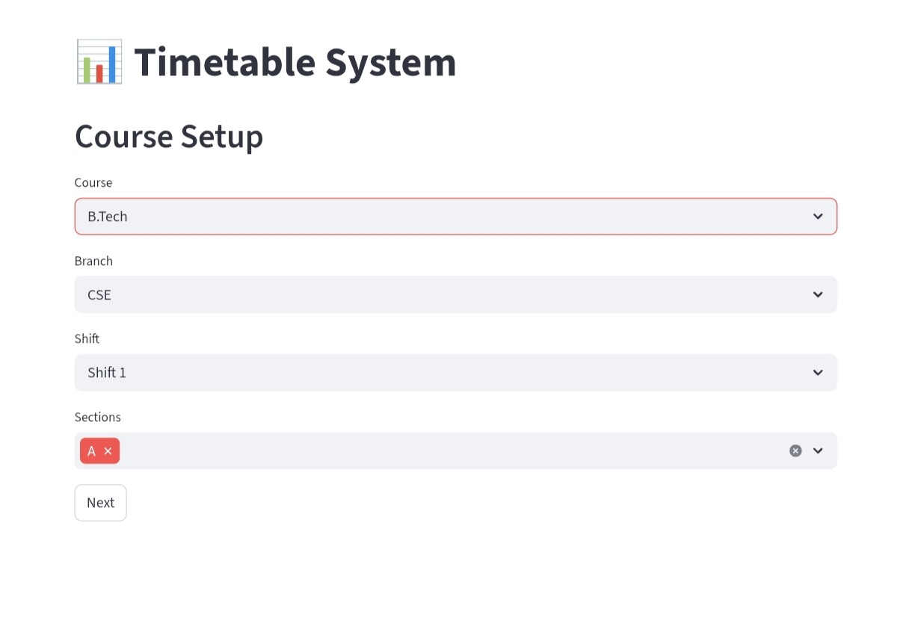
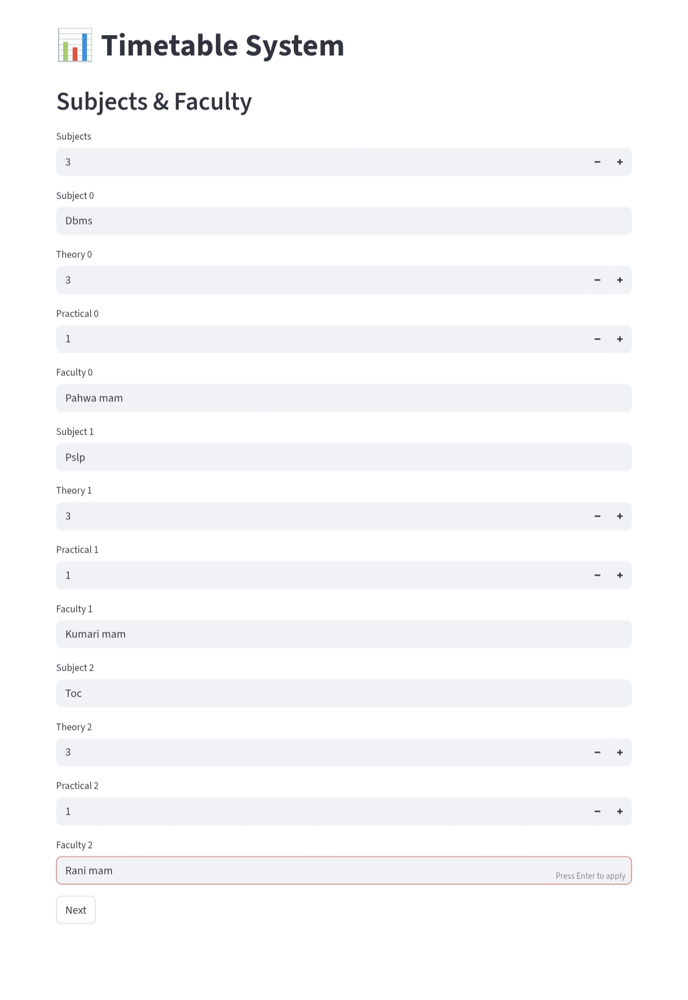
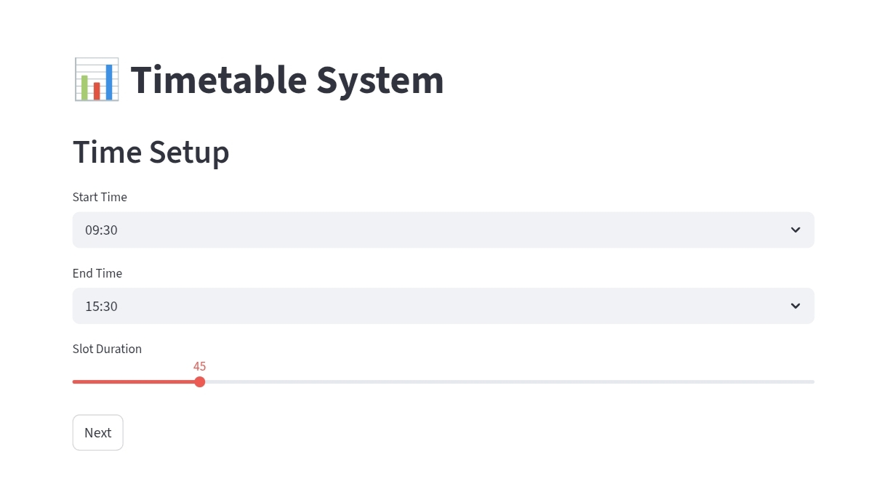
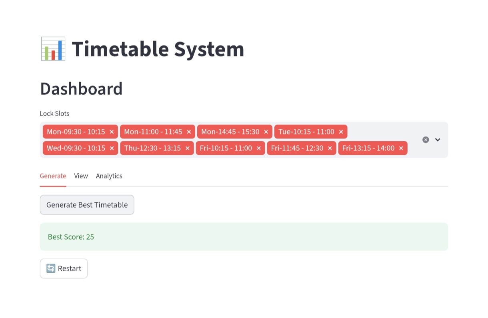
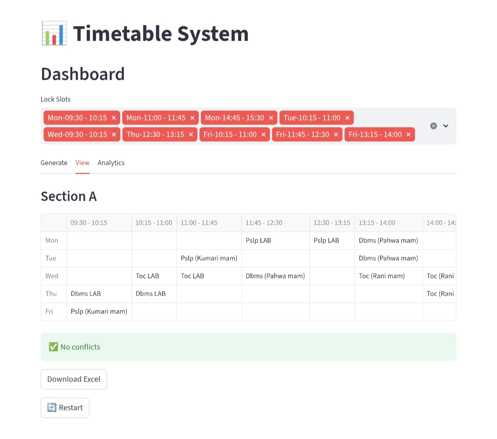
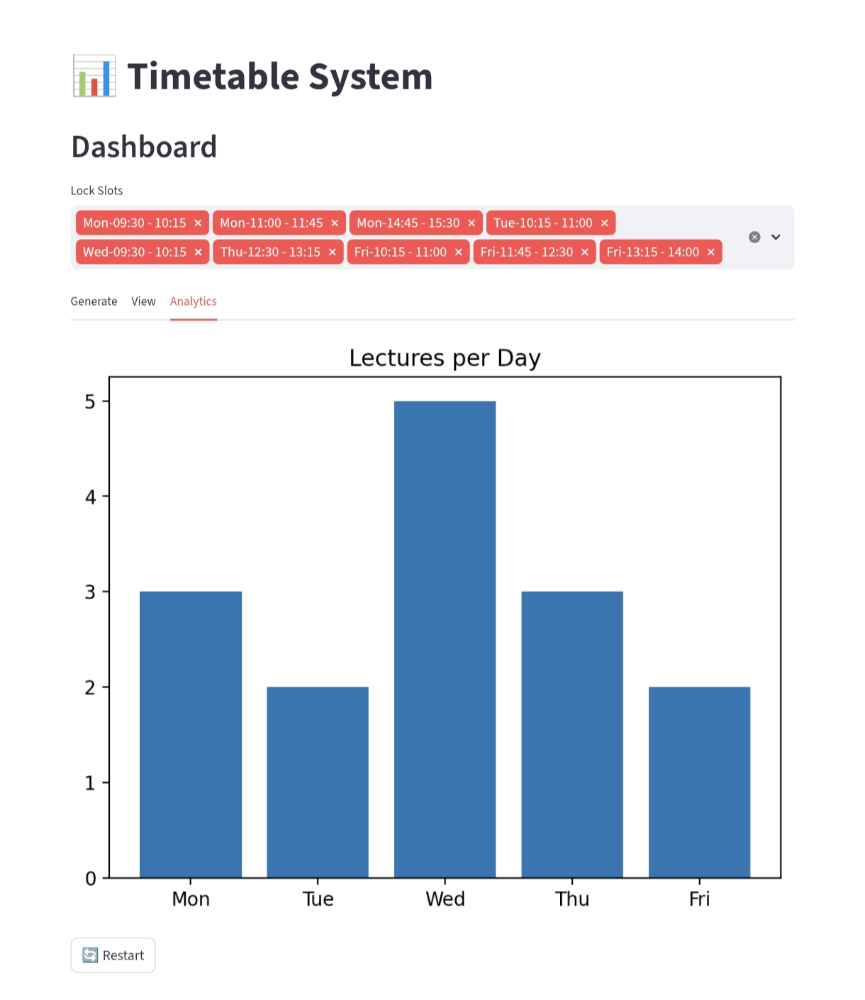

# 🤖 AI Timetable Generator

An intelligent academic scheduling system that automatically generates optimized timetables with conflict detection, lab handling, and analytics.

---

## 🚀 Features

- 📘 Course, Branch, Shift & Section selection  
- 👨‍🏫 Subjects with Theory + Practical (Lab support)  
- ⏰ Time slot configuration  
- 🔒 Lock specific time slots  
- ⚠️ Conflict detection (faculty clash)  
- 💯 Best timetable score generation  
- 📊 Analytics (lectures per day)  
- 📥 Export timetable to Excel  

---
## 🖥️ Features Preview

### 🏠 Welcome Page


### 🔐 Login Page


### 📘 Course Selection


### 👨‍🏫 Subjects & Faculty


### ⏰ Time Configuration


### ⚙️ Generate Timetable


### 📊 View Timetable


### 📈 Analytics


---

## 🛠️ Tech Stack

- Python  
- Streamlit  
- Pandas  
- Matplotlib  

---

## ▶️ How to Run

```bash
pip install streamlit pandas matplotlib openpyxl
streamlit run app.py
